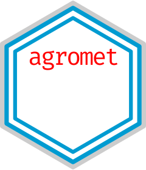

<!-- README.md is generated from README.Rmd. Please edit that file -->

```{r, include = FALSE}
knitr::opts_chunk$set(
  collapse = TRUE,
  comment = "#>",
  fig.path = "man/figures/README-",
  out.width = "100%"
)
```

# agromet 

<!-- badges: start -->
[](https://github.com/AgRoMeteorologiaINTA/agromet/actions)
[](https://travis-ci.org/AgRoMeteorologiaINTA/agromet)
<!-- badges: end -->

El paquete {agromet} incluye una serie de funciones para calcular índices y estadísticos climáticos e hidrológicos a partir de datos tidy. Por ejemplo `umbrales()` permite contar la cantidad de observaciones que cumplen una determinada condición y `dias_promedios()` devuelve el primer y último día del año promedio de ocurrencia de un evento. 

Otras funciones como `spi()` funcionan como wrappers de funciones de otros paquetes y que buscan ser compatibles con el manejo de datos tidy. 

Finalmente el paquete incluye una función de graficado de datos georeferenciados `mapear()` con el estilo y logo propios de INTA.

## Instalación 

Para instalar la versión de desarrollo desde [GitHub](https://github.com/), usá: 

``` r
# install.packages("remotes")
remotes::install_github("AgRoMeteorologiaINTA/agromet")
```

## Ejemplos

A continuación se muestra el uso de algunas funciones. Podés encontrar más ejemplos y usos de las funciones en [acá va el link a la viñeta]

Si se quieren utilizar los datos con formato NH se puede utilizar la función `leer_nh()` y opcionalmente acceder a sus metadatos con `metadatos_nh()`.

```{r message=FALSE, warning=FALSE}
library(agromet)
library(dplyr)

archivo <- system.file("extdata", "NH0011.DAT", package = "agromet")

datos <- leer_nh(archivo)
```

### Días promedio

Si por ejemplo se quiere obtener el día de la primera y última helada en promedio, asumiendo que la ocurrencia de helada corresponde a temperatura mínima menor a 0°C, se puede utilizar la función `dias_promedio()` en el contexto de `summarise()`.

```{r}
datos %>% 
  filter(t_min <= 0) %>% 
  summarise(dias_promedio(fecha))
```


### Mapear 

La función `mapear()` grafica una variable dada en puntos discretos e irregulares (en general observaciones o datos derivados de estaciones meteorológicas) utilizando kriging. Se puede definir el título y epígrafe y opcionamente se puede incluir la cordillara para enmascarar la variable a graficar.

```{r message=FALSE, warning=FALSE}
# Genero datos aleatorios 
set.seed(934)
datos_aleatorios <- data.frame(metadatos_nh(), pp = rgamma(nrow(metadatos_nh()), 1))

datos_aleatorios %>% 
  with(mapear(pp, lon, lat, cordillera = TRUE,
              titulo = "Precipitación aleatoria", fuente = "Fuente: datos de ejemplo"))
```


## Cómo contribuir

Para contribuir con este paquete podés leer la siguiente [guía para contribuir](https://github.com/AgRoMeteorologiaINTA/agromet/blob/master/.github/CONTRIBUTING.md). Te pedimos también que revises nuestro [Código de Conducta](https://www.contributor-covenant.org/es/version/2/0/code_of_conduct/code_of_conduct.md). 
