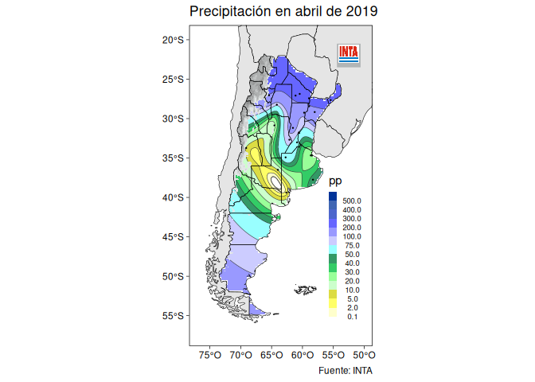

<!-- README.md is generated from README.Rmd. Please edit that file -->

# agroclimatico 

<!-- badges: start -->

[](https://github.com/ropensci/agroclimatico/actions/workflows/R-CMD-check.yaml)
[](https://codecov.io/gh/ropensci/agroclimatico?branch=master)
[](https://github.com/ropensci/software-review/issues/599)
<!-- badges: end -->

El paquete {agroclimatico} incluye una serie de funciones para calcular
índices y estadísticos climáticos e hidrológicos a partir de datos
[*tidy*](https://es.r4ds.hadley.nz/12-tidy.html). Por ejemplo
`umbrales()` permite contar la cantidad de observaciones que cumplen una
determinada condición y `dias_promedio()` devuelve el primer y último
día del año promedio de ocurrencia de un evento.

Otras funciones como `spi_indice()` funcionan como wrappers de funciones
de otros paquetes y buscan ser compatibles con el manejo de datos tidy
usando por ejemplo los verbos de dplyr.

Finalmente el paquete incluye una función de graficado de datos
georeferenciados `mapear()` con el estilo y logo propios de [Instituto
Nacional de Tecnología Agropecuaria](https://www.argentina.gob.ar/inta)
(INTA). Como complementos el paquete también provee mapas de Argentina a
nivel nacional, provincial y por departamentos que se pueden usar en el
contexto de ggplot para graficar variables meteorológicas e índices
agroclimáticos.

## Instalación

Para instalar la versión actual del paquete podés usar:

``` r
install.packages("agroclimatico", repos = "https://ropensci.r-universe.dev")
```

O ussando `remotes`:

``` r
# install.packages("remotes")
remotes::install_github("ropensci/agroclimatico", build_vignettes = TRUE)
```

## Ejemplos

A continuación se muestra el uso de algunas funciones. Podés encontrar
más ejemplos y usos en la viñeta, con

``` r
vignette("estadisticas-e-indices-climaticos", "agroclimatico")
```

Si se quieren utilizar los datos con formato NH (archivos con columnas
de ancho fijo usado por el INTA para distribuir los datos de las
estaciones meteorológicas de su red) se puede utilizar la función
`leer_nh()` y opcionalmente acceder a sus metadatos con
`metadatos_nh()`.

``` r
library(agroclimatico)
library(dplyr)

archivo <- system.file("extdata", "NH0358.DAT", package = "agroclimatico")

datos <- leer_nh(archivo)
```

### Días promedio

Si por ejemplo se quiere obtener el día de la primera y última helada en
promedio, asumiendo que la ocurrencia de helada corresponde a
temperatura mínima menor a 0°C, se puede utilizar la función
`dias_promedio()` en el contexto de `reframe()`.

``` r
datos %>% 
  filter(t_min <= 0) %>% 
  reframe(dias_promedio(fecha))
#>     variable dia mes dia_juliano
#> 1 primer_dia  16   5         136
#> 2 ultimo_dia  14   9         257
```

### Mapear

La función `mapear()` grafica una variable dada en puntos discretos e
irregulares (en general observaciones o datos derivados de estaciones
meteorológicas) utilizando kriging. Se puede definir el título y
epígrafe y opcionamente se puede incluir la cordillera para enmascarar
la variable a graficar.

``` r
abril <- datos_nh_mensual %>%
  filter(mes == unique(mes)[4]) #datos del cuarto mes en la base, abril.

abril %>% 
  mapear(precipitacion_mensual, lon, lat, cordillera = TRUE,
              escala = escala_pp_mensual,
              titulo = "Precipitación en abril de 2019", 
              fuente = "Fuente: INTA",
              variable = "pp")
```



## Cómo contribuir

Para contribuir con este paquete podés leer la siguiente [guía para
contribuir](https://github.com/ropensci/agroclimatico/blob/master/.github/CONTRIBUTING.md).
Te pedimos también que revises nuestro Código de Conducta.
