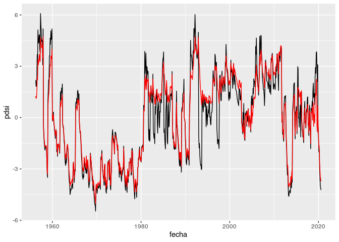

Ejemplos de uso del paquete {agromet}
================

## Lectura de archivo NH

Asumiendo que los datos de estaciones de la base de datos NH están en
una carpeta “datos” dentro del proyecto, la función `leer_nh()` funciona
así:

``` r
datos <- leer_nh("datos/NH0011.DAT")
```

    ## Warning: 1 parsing failure.
    ##   row col expected actual               file
    ## 20969 etp  4 chars      3 'datos/NH0011.DAT'

``` r
head(datos)
```

    ##    codigo codigo_nh      fecha t_max t_min prcp lluvia_datos lluvia llovizna
    ## 1:      5      0011 1956-04-01  25.0  11.2  0.0            0     NA       NA
    ## 2:      5      0011 1956-04-02  28.7  16.5  2.4            1     NA       NA
    ## 3:      5      0011 1956-04-03  28.7  20.7  1.5            1     NA       NA
    ## 4:      5      0011 1956-04-04  26.7  19.8  0.0            0     NA       NA
    ## 5:      5      0011 1956-04-05  25.6  15.6  0.0            0     NA       NA
    ## 6:      5      0011 1956-04-06  27.2  16.4  0.9            1     NA       NA
    ##    granizo nieve t_aire_max t_aire_min t_suelo_max t_suelo_min heliofania
    ## 1:      NA    NA         NA         NA          NA          NA       11.1
    ## 2:      NA    NA         NA         NA          NA          NA        2.2
    ## 3:      NA    NA         NA         NA          NA          NA        3.8
    ## 4:      NA    NA         NA         NA          NA          NA        0.0
    ## 5:      NA    NA         NA         NA          NA          NA        3.0
    ## 6:      NA    NA         NA         NA          NA          NA        0.4
    ##    heliofania_rel p_vapor hr td rocio viento_med viento_2m  rad etp
    ## 1:             94      NA NA NA    NA         NA        NA 22.6  NA
    ## 2:             18      NA NA NA    NA         NA        NA  9.0  NA
    ## 3:             32      NA NA NA    NA         NA        NA 11.4  NA
    ## 4:              0      NA NA NA    NA         NA        NA  5.7  NA
    ## 5:             25      NA NA NA    NA         NA        NA 10.0  NA
    ## 6:              3      NA NA NA    NA         NA        NA  6.2  NA

Además la funciónn `metadatos_nh()` devuelve un data frame con los
metadatos de las estaciones que se puede utilizar para conocer el nombre
y ubicación de las estaciones.

## Conteo de días que cumplen con alguna condición

Para contar la cantidad de diás con temperatura por encima de un umbral
o días con precipitación igual a cero (o básicamente que cualquier
variable cumpla con cualquier condición) se utiliza la función
`extremos()` \[o inserte aquí un mejor nombre\].

Por ejemplo si queremos la cantidad de días donde la temperatura máxima
fue mayor o igual a 30 grados en toda la serie.

``` r
datos %>% 
  summarise(extremos(t_30 = t_max >= 30))
```

    ##       N      prop  na extremo
    ## 1 12616 0.5532605 721    t_30

Pero si quisieramos hacer el mismo conteo para cada año:

``` r
datos %>% 
  group_by(anio = floor_date(fecha, "year")) %>% 
  summarise(extremos(t_30 = t_max >= 30))
```

    ## `summarise()` ungrouping output (override with `.groups` argument)

    ## # A tibble: 65 x 5
    ##    anio                    N    prop    na extremo
    ##    <dttm>              <int>   <dbl> <int> <chr>  
    ##  1 1956-01-01 00:00:00    18   0.18    175 t_30   
    ##  2 1957-01-01 00:00:00   180   0.496     2 t_30   
    ##  3 1958-01-01 00:00:00     0 NaN       365 t_30   
    ##  4 1959-01-01 00:00:00   174   0.477     0 t_30   
    ##  5 1960-01-01 00:00:00   188   0.514     0 t_30   
    ##  6 1961-01-01 00:00:00   198   0.574    20 t_30   
    ##  7 1962-01-01 00:00:00   175   0.479     0 t_30   
    ##  8 1963-01-01 00:00:00   206   0.566     1 t_30   
    ##  9 1964-01-01 00:00:00   181   0.495     0 t_30   
    ## 10 1965-01-01 00:00:00   194   0.532     0 t_30   
    ## # … with 55 more rows

Esta fucnión también acepta contar cantidad de días según distintos
umbrales. De yapa, un gráfico.

``` r
datos %>% 
  group_by(anio = floor_date(fecha, "year")) %>% 
  summarise(extremos(t_30 = t_max >= 30,
                     t_35 = t_max >= 35)) %>% 
  ggplot(aes(anio, N)) +
  geom_line(aes(color = extremo))
```

    ## `summarise()` regrouping output by 'anio' (override with `.groups` argument)

<!-- -->

## SPI

La función `spi` calcula el SPI para distintas escalas:

``` r
datos %>% 
  summarise(spi(fecha, prcp, 1:24)) %>% 
  head()
```

    ##        fecha escala       spi
    ## 1 1956-04-01      1 0.4887764
    ## 2 1956-05-01      1 0.7764218
    ## 3 1956-06-01      1 0.9467818
    ## 4 1956-07-01      1 2.4233927
    ## 5 1956-08-01      1        NA
    ## 6 1956-09-01      1 1.2206403

La salida se puede graficar faćilmente con ggplot

``` r
datos %>% 
  summarise(spi(fecha, prcp, 1:24)) %>% 
  ggplot(aes(fecha, escala)) +
  geom_contour_filled(aes(z = spi, fill = stat(level_mid))) +
  scale_fill_gradient2()
```

    ## Warning: Removed 353 rows containing non-finite values (stat_contour_filled).

<!-- -->

## Índice de Severidad de Sequía de Palmer

`pdsi` computa el PDSI con los coeficientes de Palmer (1965), `pdsi_ac`
es la versión autocalibrada.

``` r
datos %>% 
  group_by(fecha = floor_date(fecha, "month")) %>% 
  summarise(prcp = sum(prcp, na.rm = TRUE),
            etp = sum(etp, na.rm = TRUE)) %>% 
  mutate(pdsi_ac = pdsi_ac(prcp, etp),
         pdsi    = pdsi(prcp, etp)) %>% 
  ggplot(aes(fecha, pdsi)) +
  geom_line() +
  geom_line(aes(y = pdsi_ac), color = "red")
```

    ## `summarise()` ungrouping output (override with `.groups` argument)

<!-- -->
